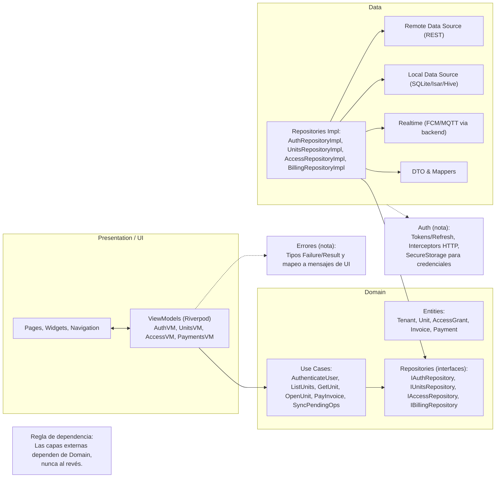
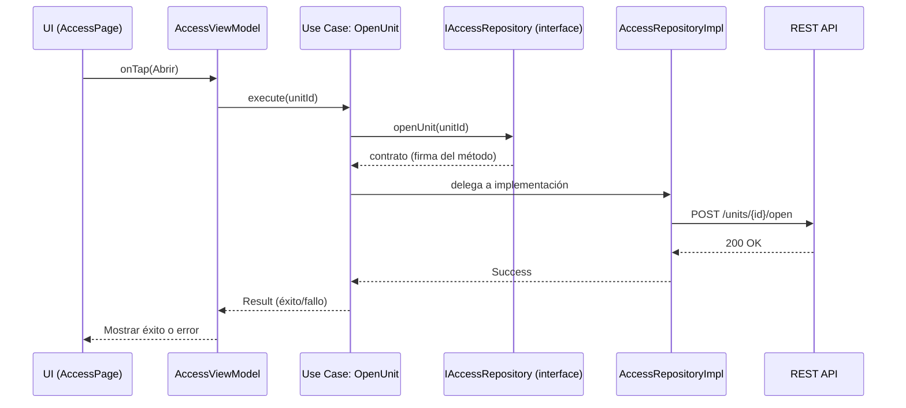

# Práctica — Arquitectura de Software Móvil (SmartStorage Garage)

## Contexto del proyecto
Aplicación Flutter (Android/iOS) para arrendatarios de **SmartStorage Garage**:
- Reservar una unidad y abrir/cerrar con credenciales temporales (QR/NFC/PIN).
- Ver y pagar facturas; recibir notificaciones push (alertas de humedad/intrusión y recordatorios de cobro).
- **Offline-first**: mostrar estado y credenciales cacheadas; encolar acciones para sincronizar al volver la red.

**Fuentes de datos:** API REST del backend, caché local (SQLite/Isar/Hive), notificaciones FCM.  
Los eventos IoT (MQTT) se procesan en el backend y se reflejan en la app vía REST o push.

**Equipo:** **5 integrantes** (2 Flutter: 1 lead y 1 mid; 1 backend API/DB; 1 IoT/Edge —gateway, MQTT, cámaras—; 1 QA/DevOps —CI, pruebas, releases—).  
**Objetivo:** mantenibilidad y testabilidad con ramp-up rápido y entregas paralelas por vertical (feature slices).

---

## Selección de arquitectura
Elegimos **MVVM + Clean Architecture** con **Riverpod** como gestión de estado e inyección ligera.

### Por qué
- **Mantenibilidad:** el *Domain* es independiente de Flutter/SDKs. Cambios en API o UI no rompen reglas de negocio.
- **Escalabilidad:** repositorios como **interfaces**; fácil añadir fuentes (REST/Firestore/cache) o nuevos casos de uso.
- **Testabilidad:** *Use cases* y *ViewModels* se prueban con dobles (mocks/fakes) de repositorios.
- **Offline-first:** repositorios implementan *single source of truth* con políticas de sincronización claras.
- **Realtime:** adaptadores en *Data* traducen MQTT/FCM a streams sin acoplar el *Domain* al transporte.

---

## Comparativa breve
| Criterio | MVC | MVVM | Clean (capas + MVVM) |
|---|---|---|---|
| Responsabilidades | Controller concentra navegación/lógica (riesgo “God Controller”). | ViewModel expone estado/acciones; View pasiva. | Domain puro con entidades/use cases; Data con repos; Presentation desacoplada. |
| Flujo de datos | Bidireccional View↔Model. | Unidireccional (VM fuente de verdad). | Unidireccional; dependencias apuntan a Domain. |
| Testabilidad | Media (acople a framework). | Alta (VM testeable sin framework). | Muy alta (Domain 100% testeable; repos mockeables). |
| Complejidad inicial | Baja/Media. | Media. | Media/Alta (más clases/abstracciones). |
| Curva de aprendizaje | Baja. | Media. | Media/Alta (disciplina en capas y mapeos DTO↔Entidad). |
| Dependencia de frameworks | Alta. | Media. | Baja en Domain; Presentation/Data pueden variar sin tocar Domain. |

---

## Riesgos y mitigaciones
- **Boilerplate / sobre-arquitectura en MVP.** Mitigación: vertical slices por feature + codegen (freezed/json_serializable).
- **ViewModels “gordos”.** Mitigación: mover reglas a Use Cases; VM como orquestador de estado.
- **Violación de la regla de dependencia (UI conoce Data).** Mitigación: depender de interfaces en Domain e inyectar implementaciones en Data.
- **Complejidad de sincronización offline.** Mitigación: políticas write-through o write-behind, colas de operaciones, reconciliación por timestamp/versión.

---

## Estado en Flutter (gestión de estado)
- **Estrategia:** **Riverpod** (providers para UseCases y Repos), navegación con GoRouter.
- **Alternativas:** **BLoC** (si se prefiere flujo por eventos) y **Provider** (proyectos pequeños/POC).
- **Pruebas:** unit (usecases, mappers), widget (pantallas críticas), integración (repos + caché + red).

---

## Estructura de carpetas sugerida (MVVM + Clean)
```
lib/
  core/            # errores, Result/Either, utils, network_info, env, logger, secure_storage
  domain/
    entities/
    repositories/  # interfaces (abstracciones)
    usecases/
  data/
    datasources/   # remoto/local/realtime
    models/        # DTO + mappers
    repositories_impl/
  presentation/
    viewmodels/
    pages/
    widgets/
```

---

## Diagramas

### Arquitectura (Mermaid)


### Secuencia “Abrir Unidad” (Mermaid)


---

## Pruebas previstas
- **UseCases:** lógica de negocio (rutas de éxito y error).
- **Repositories:** contrato con fuentes (remoto/local/realtime) y estrategia de caché (*single source of truth*).
- **ViewModels:** transiciones de estado, mapeo de errores a UI y manejo de *loading*.
- **Integración:** sincronización offline (cola de operaciones), expiración/renovación de tokens, reintentos idempotentes.

---

## Seguridad (OWASP Mobile Top 10)
- Almacenamiento seguro de credenciales (SecureStorage, Keychain/Keystore).
- TLS estricto y, de ser posible, certificate pinning.
- Autenticación/Autorización robusta (tokens con refresh y scopes).
- Evitar exponer datos sensibles en logs y backups; ofuscación cuando aplique.
- Revisar **OWASP Mobile Top 10 (2024)** y **MASVS** para checklist de seguridad.

---

## Entregables
- `docs/Justificacion.pdf` — Justificación de la selección de arquitectura.
- Diagramas en este README (Mermaid) y opcionalmente exportados a `docs/*.png`.

---

## Referencias
- Android Developers — Guide to App Architecture: https://developer.android.com/topic/architecture  
- Android Developers — Architecture Recommendations: https://developer.android.com/topic/architecture/recommendations  
- Robert C. Martin — The Clean Architecture: https://blog.cleancoder.com/uncle-bob/2012/08/13/the-clean-architecture.html  
- Martin Fowler — GUI Architectures / MVC: https://martinfowler.com/eaaDev/uiArchs.html  
- Flutter — State management (overview): https://docs.flutter.dev/data-and-backend/state-mgmt  
- Flutter — Local caching / Offline-first: https://docs.flutter.dev/get-started/fundamentals/local-caching  
- Riverpod — Docs: https://riverpod.dev/  
- OWASP — Mobile Top 10 (2024): https://owasp.org/www-project-mobile-top-10/
